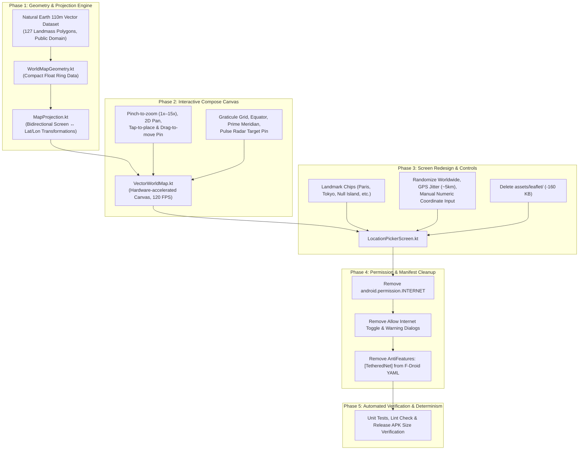

# 🗺️ Offline Vector World Map & Zero-Permission Plan (v0.5.0)

## Objective
Eliminate the `android.permission.INTERNET` dependency completely from MetaJammer, transforming the application into a **100% air-gapped, zero-permission privacy utility**, removing the `TetheredNet` Anti-Feature from F-Droid, and replacing the third-party OpenStreetMap/Leaflet `WebView` with a high-performance, lightweight **Native Jetpack Compose Vector World Map**.

---

## Architecture & Technology Stack

---

## Phased Implementation Roadmap

### Phase 1: Vector World Map Geometry & Projection Engine
* **Dataset**: Natural Earth 110m land polygons (127 polygons, 5,143 points, 100% Public Domain).
* **Package**: `com.heronikostudios.metajammer.ui.components.map`
* **Components**:
  - `WorldMapGeometry.kt`: Pre-calculated landmass path data stored compactly as float rings.
  - `MapProjection.kt`: Forward and inverse Equirectangular projection equations:
    $$\text{lon} = \left(\frac{x}{w}\right) \times 360^\circ - 180^\circ \quad \longleftrightarrow \quad x = \left(\frac{\text{lon} + 180^\circ}{360^\circ}\right) \times w$$
    $$\text{lat} = 90^\circ - \left(\frac{y}{h}\right) \times 180^\circ \quad \longleftrightarrow \quad y = \left(\frac{90^\circ - \text{lat}}{180^\circ}\right) \times h$$
* **Tests**: `MapProjectionTest.kt` verifying bidirectional round-trip accuracy, pole boundaries (-90/+90), date-line wrapping (-180/+180), and Null Island (0,0).
* **Commit**: `feat(map): implement equirectangular vector map geometry and projection engine`

---

### Phase 2: Interactive Compose World Map Component (`VectorWorldMap.kt`)
* **Compose `Canvas` Hardware Acceleration**:
  - Draws oceans and theme-aware landmass fill (`MaterialTheme.colorScheme.surfaceVariant`) + borders.
  - Draws subtle coordinate graticule grid lines (Equator, Prime Meridian, 30°/60° parallels).
* **Gestures**:
  - `detectTransformGestures` for fluid pinch-to-zoom (1.0x to 15.0x) and pan translation with bounds clamping.
  - Tap anywhere to place marker; drag marker for fine placement.
* **Pin Marker**:
  - Stylized location pin + radar crosshair target.
  - Floating coordinates tooltip badge (`48.8584° N, 2.2945° E`).
* **Commit**: `feat(map): create interactive VectorWorldMap composable with gestures and pin target`

---

### Phase 3: Screen Redesign & Preset Controls (`LocationPickerScreen.kt`)
* **Replace WebView**: Swap out `AndroidView(WebView)` for `VectorWorldMap`.
* **Preset Navigation**: Top bar with landmark chips (Paris, Tokyo, New York, Bermuda Triangle, etc.) that smoothly pan and zoom to target.
* **Control Dock**:
  - **Randomize** button: Instantly generates a random worldwide coordinate.
  - **GPS Jitter** button: Adds realistic drift (~2–10 km) to current point.
  - **Manual Input**: Tap coordinate badge to manually type or paste latitude/longitude.
  - **Recenter** button: Instantly centers camera on the active pin.
  - **Confirm Location** button.
* **Asset Cleanup**: Delete `assets/leaflet/leaflet.js` and `leaflet.css` (saving ~160 KB).
* **Commit**: `feat(ui): replace Leaflet WebView with native offline LocationPickerScreen`

---

### Phase 4: Zero-Permission & Manifest Hardening
* **`AndroidManifest.xml`**: Remove `<uses-permission android:name="android.permission.INTERNET" />`.
* **Settings & Nav**: Remove `allowInternetForMap` setting, toggle row, and warning dialogs. Tapping "Edit Location" navigates directly to the map with zero warnings.
* **F-Droid Metadata**: Remove `AntiFeatures: - TetheredNet` from `metadata/com.heronikostudios.metajammer.yml`.
* **Audit Docs**: Update `security_audit.md` and `foss_audit.md` to declare 100% air-gapped status.
* **Commit**: `refactor(privacy): remove INTERNET permission and TetheredNet anti-feature`

---

### Phase 5: Verification, APK Determinism & Lint Check
* Run `./gradlew testFlossDebugUnitTest assembleFlossRelease`.
* Run `./gradlew lintFlossDebug` (verify 0 errors, 0 warnings).
* Confirm APK size reduction and clean determinism.
* **Commit**: `chore(release): bump to v0.5.0 with air-gapped offline map`
