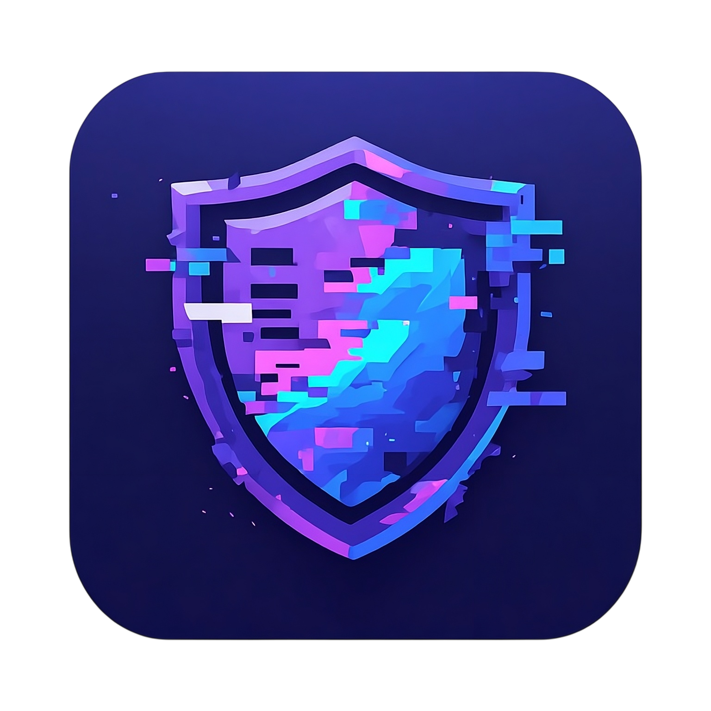
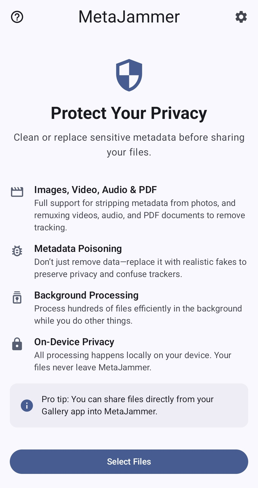
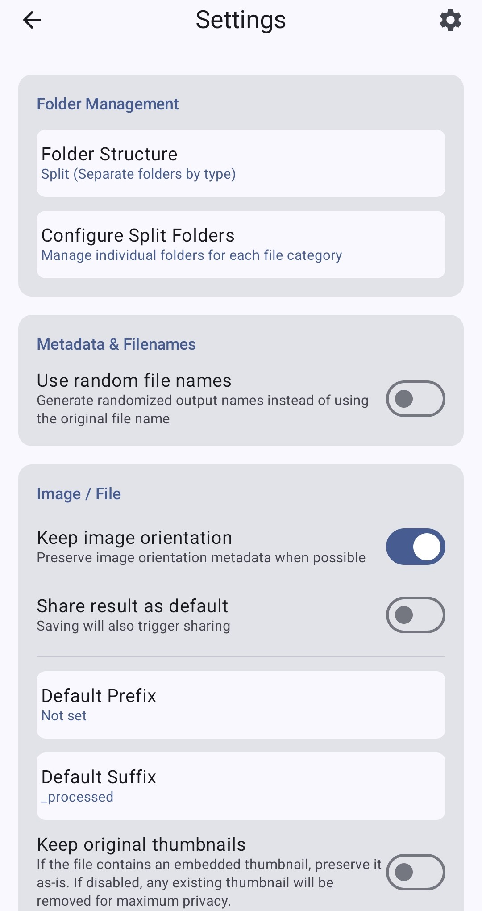
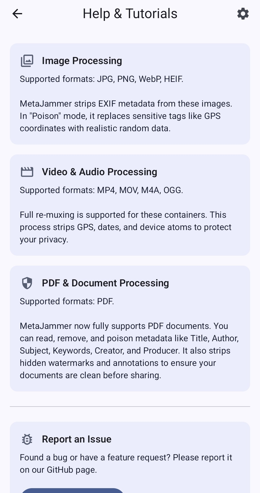

<p align="center">
  
</p>

# MetaJammer

**MetaJammer** is a privacy-focused Android application designed to scramble, fake, or completely strip metadata from your media files. It provides users with total control over their digital footprint before sharing photos or videos online.

## Key Features

- **🛡️ Deep Metadata Stripping:** More than just EXIF. MetaJammer targets XMP, GPS coordinates, hardware serial numbers, and embedded thumbnails to ensure no "leaks" remain.
- **🧪 Metadata Poisoning:** Don't just remove data—confuse it. Generate highly realistic fake metadata (camera models, exposure settings, software versions, and custom descriptions) to blend in.
- **🔍 Metadata Preview:** Inspect the existing metadata of your files before processing them to see exactly what information is being exposed.
- **🗺️ Interactive Map Picker:** Visually choose a "fake" location on an OpenStreetMap interface for your poisoned metadata.
- **⚡ Quick Scrub & Share:** A "truly invisible" workflow. Share a file to MetaJammer, let it auto-process, and immediately re-open the share sheet with the clean version.
- **📦 Background Batch Processing:** Reliable processing for 50+ high-resolution files at once using Android WorkManager, complete with system notifications.
- **📂 Flexible Output:** Save to custom folders via SAF, use standard MediaStore collections, or share directly to other apps.
- **🖼️ Multi-Format Support:** Full compatibility with modern image formats (JPEG, WebP, HEIF/HEIC), video containers (MP4, MOV), and PDF documents. Support for both stripping and poisoning across all formats, including PDF-specific fields like Title, Author, and Producer. Now includes advanced removal of hidden watermarks and annotations from PDF files.
- **🎨 Modern & Accessible UI:** Built with Jetpack Compose and Material 3, featuring Dynamic Color support, a dedicated OLED black mode, and battery-aware theme scheduling.
- **🌍 Global Reach:** Fully localized in 24 languages including English, Arabic, German, Greek, Spanish, Persian, French, Hebrew, Hindi, Indonesian, Italian, Japanese, Korean, Latin, Dutch, Polish, Portuguese, Romanian, Russian, Thai, Turkish, Ukrainian, Vietnamese, and Chinese.

## Privacy & Security

MetaJammer is built on the **Principle of Least Privilege**:

- **Zero Broad Permissions:** The app requires NO `READ_EXTERNAL_STORAGE` or `WRITE_EXTERNAL_STORAGE` permissions. It uses modern Scoped Storage and SAF.
- **100% FOSS:** Built entirely with Free and Open Source Software. No proprietary SDKs, trackers, or "phone-home" analytics.
- **Opt-in Internet:** Internet access is strictly restricted to the optional Map Picker and is only active after explicit user consent.
- **Hardened I/O:** Every filename is sanitized and processing is isolated to specific subdirectories to prevent path-traversal or unauthorized access.
- **No Cloud Leaks:** Android Auto-Backup is disabled to ensure unstripped metadata never leaves your device during processing.
- **Automatic Cleanup:** All temporary processing residue is programmatically wiped from the cache after every session.

## FOSS & Transparency

MetaJammer is committed to transparency and user trust. A comprehensive [FOSS Compliance Audit](foss_audit.md) is available to verify that no proprietary or non-free components are used in the project.

## Getting Started

1. **Clone this repo:**  
   `git clone https://github.com/GabryDX/MetaJammer.git`
2. **Open in Android Studio (Ladybug or newer recommended).**
3. **Build & run on your Android device (minSdk 33).**

## APK Verification

To verify the authenticity and integrity of MetaJammer APKs, you can use [AppVerifier](https://github.com/soupslurpr/AppVerifier).

- **Package Name:** `com.heronikostudios.metajammer`
- **SHA-256 Key:**  
  ```
  36:D6:9B:D7:8C:8A:44:90:C2:BC:3F:53:29:6A:BD:68:88:7E:2A:50:AD:9B:9D:A1:C3:6C:CC:D6:4E:96:AF:01
  ```

## Screenshots

<p align="center">
  
  

</p>

## License

This project is licensed under the [ISC License](LICENSE.txt).

---

**Contributions are welcome!** Feel free to open issues or pull requests to help make mobile privacy more accessible.
