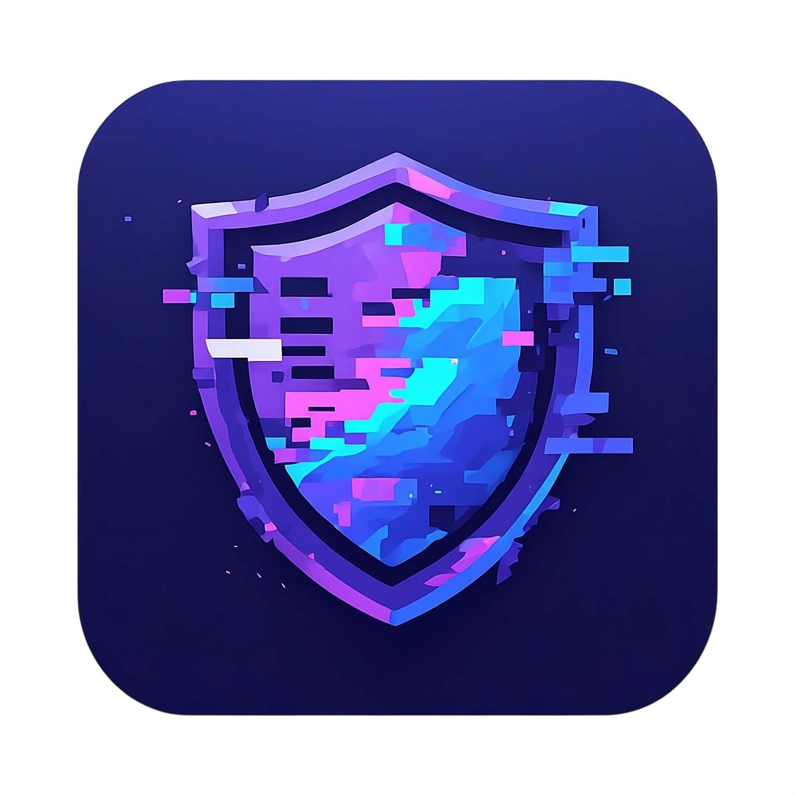
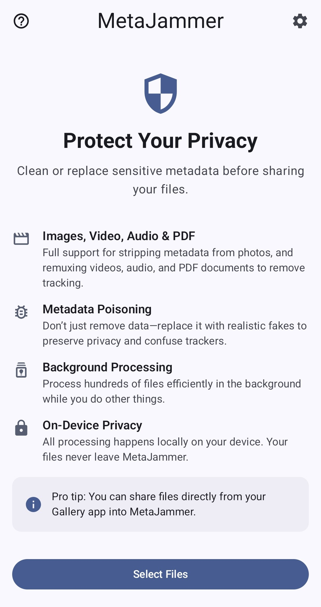
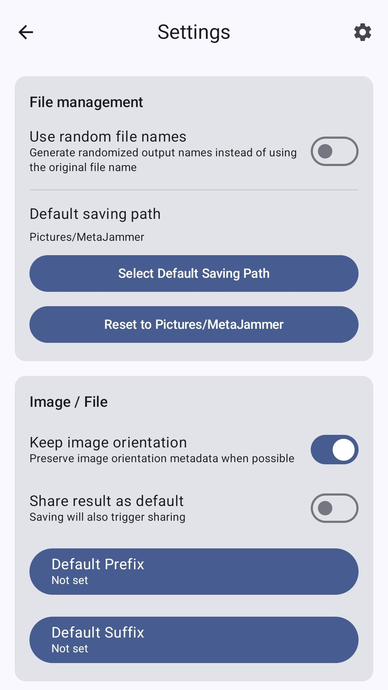
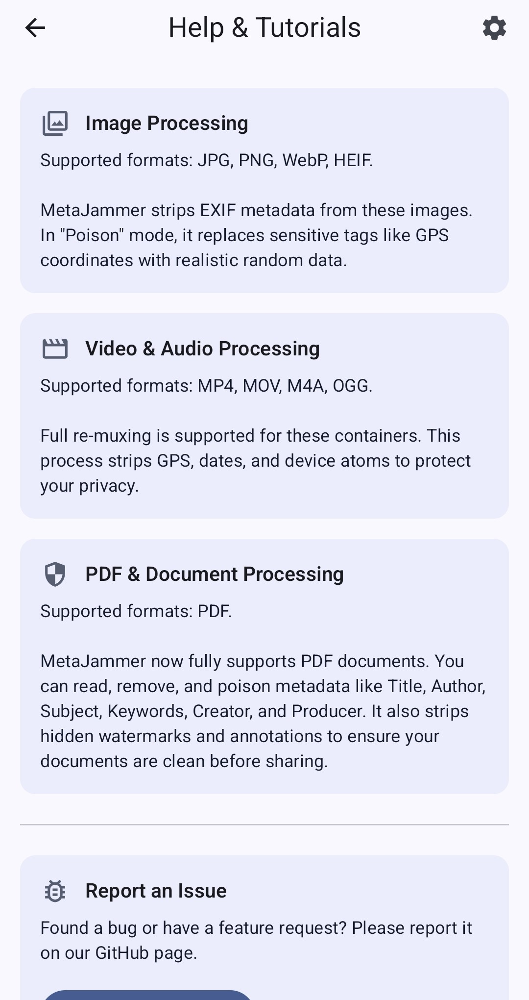

<p align="center">
  
</p>

# MetaJammer

**MetaJammer** is a privacy-focused Android application designed to scramble, fake, or completely strip metadata from your media files. It provides users with total control over their digital footprint before sharing photos or videos online.

## Key Features

- **🛡️ Deep Metadata Stripping:** More than just EXIF. MetaJammer targets EXIF, XMP, GPS coordinates, hardware serial numbers, embedded thumbnails, PNG chunks (`tEXt`, `zTXt`, `iTXt`, `pHYs`, `eXIf`), and SVG embedded metadata to ensure no "leaks" remain.
- **🧪 Metadata Poisoning & Profiles:** Don't just remove data—confuse it. Generate highly realistic fake metadata with camera hardware profiles (Pro Mirrorless, Smartphone, Vintage, Random) and instant location presets.
- **🎛️ Granular Tag Controls:** Selectively strip or preserve individual metadata categories: GPS & Location, Device & Hardware, Date & Time, Camera Settings, and Author & Comments.
- **📊 Before / After Visual Diff & Unified Scrolling:** Inspect original vs. modified metadata side-by-side with color-coded status badges (`REMOVED`, `POISONED`, `KEPT`), a sticky filter header (`All`, `Removed`, `Poisoned`, `Kept`), and collapsible poisoning settings for a smooth, single-scroll experience.
- **🔍 Metadata Preview:** Inspect the existing metadata of your files before processing them to see exactly what information is being exposed.
- **🗺️ Interactive Map Picker & Offline Presets:** Visually choose a "fake" location on an OpenStreetMap interface (powered by local bundled Leaflet assets) or pick from instant offline location presets.
- **⚡ Quick Scrub & Share:** Ultra-fast, standalone HUD activity with direct single-pass PNG chunk stripping and in-memory processing. Share files to MetaJammer from any app, process instantly with zero navigation overhead, and immediately re-open the share sheet with the clean version.
- **📦 Background Batch Processing:** Reliable processing for 50+ high-resolution files at once using Android WorkManager, complete with system notifications.
- **📜 History & Retention Control:** Keep an audit log of processed files with configurable privacy retention (clear after 24 hours, keep 100 items, clear on exit, or disable history) powered by an isolated Room database.
- **📂 Flexible Output & Clean Navigation:** Save to custom folders via SAF, use standard MediaStore collections, share directly to other apps, or return to Home with one click. Intelligently preserves unsaved selections while clearing completed batches and dismissing status banners immediately.
- **🖼️ Multi-Format Support:** Full compatibility with modern image formats (JPEG, PNG, WebP, HEIF/HEIC, SVG), video containers (MP4, MOV with orientation hint preservation), and PDF documents (in-memory metadata wiping/poisoning and hidden annotation removal).
- **🎨 Modern & Accessible UI:** Built with Jetpack Compose and Material 3, featuring Dynamic Color support, a dedicated OLED black mode, tuned Coil caching for butter-smooth 120Hz scrolling, and battery-aware theme scheduling.
- **🌍 Global Reach:** Fully localized in 24 languages with 100% string parity: English, Arabic, German, Greek, Spanish, Persian, French, Hebrew, Hindi, Indonesian, Italian, Japanese, Korean, Latin, Dutch, Polish, Portuguese, Romanian, Russian, Thai, Turkish, Ukrainian, Vietnamese, and Chinese.

## Privacy & Security

MetaJammer is built on the **Principle of Least Privilege**:

- **Zero Broad Permissions:** The app requires NO `READ_EXTERNAL_STORAGE` or `WRITE_EXTERNAL_STORAGE` permissions. It uses modern Scoped Storage and SAF.
- **100% FOSS:** Built entirely with Free and Open Source Software. No proprietary SDKs, trackers, or "phone-home" analytics.
- **Fail-Closed Processing:** If processing fails or encounters unexpected corruption, MetaJammer strictly fails closed—unscrubbed raw files are never inadvertently returned, shared, or exported.
- **Local Map Assets & Opt-in Internet:** Leaflet JS and CSS are bundled locally in the app assets, eliminating external CDN dependencies. Network access is strictly restricted to optional OpenStreetMap tile loading and is only active after explicit user consent.
- **Hardened I/O & Memory:** Unicode-safe filename sanitization, 64KB buffered stream copying, direct single-pass PNG chunk manipulation, in-memory PDF processing up to 10MB, isolated subdirectories, and automatic purging of temporary processing residue.
- **No Cloud Leaks:** Android Auto-Backup is disabled to ensure unstripped metadata never leaves your device during processing.
- **Automatic Cleanup:** All temporary processing residue and stale outgoing share caches are programmatically wiped.

## Security, Privacy & Transparency

MetaJammer is committed to transparency, verifiable privacy, and user trust:
- **[Security & Privacy Audit](security_audit.md):** In-depth assessment of the threat model, fail-closed architecture, parser hardening (XXE protection, path traversal, in-memory chunk parsing), and OWASP MASVS compliance.
- **[FOSS Compliance Audit](foss_audit.md):** Complete audit verifying that 100% of dependencies, code, and assets are Free and Open Source Software.

## F-Droid

MetaJammer is designed for F-Droid. You can build the F-Droid version using the `floss` flavor:
```bash
./gradlew assembleFlossRelease
```

The app is 100% FOSS and follows F-Droid's inclusion policy. Metadata for F-Droid is located in the `fastlane` and `metadata` directories.

## Getting Started

1. **Clone this repo:**  
   `git clone https://github.com/GabryDX/MetaJammer.git`
2. **Open in Android Studio (Ladybug or newer recommended).**
3. **Build & run on your Android device (minSdk 26+ / Android 8.0 Oreo or newer).**

To run unit tests:
```bash
./gradlew testFlossDebugUnitTest
```

## APK Verification

To verify the authenticity and integrity of MetaJammer APKs, you can use [AppVerifier](https://github.com/soupslurpr/AppVerifier).

- **Package Name:** `com.heronikostudios.metajammer`
- **SHA-256 Key:**  
   ```
   36:D6:9B:D7:8C:8A:44:90:C2:BC:3F:53:29:6A:BD:68:88:7E:2A:50:AD:9B:9D:A1:C3:6C:CC:D6:4E:96:AF:01
   ```

## Screenshots

<p align="center">
  
  
  
</p>

## License

This project is licensed under the [ISC License](LICENSE.txt).

---

**Contributions are welcome!** Feel free to open issues or pull requests to help make mobile privacy more accessible.
